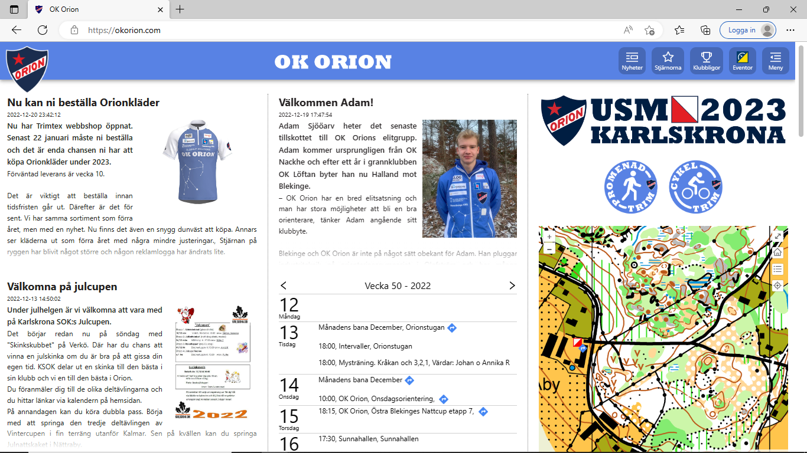
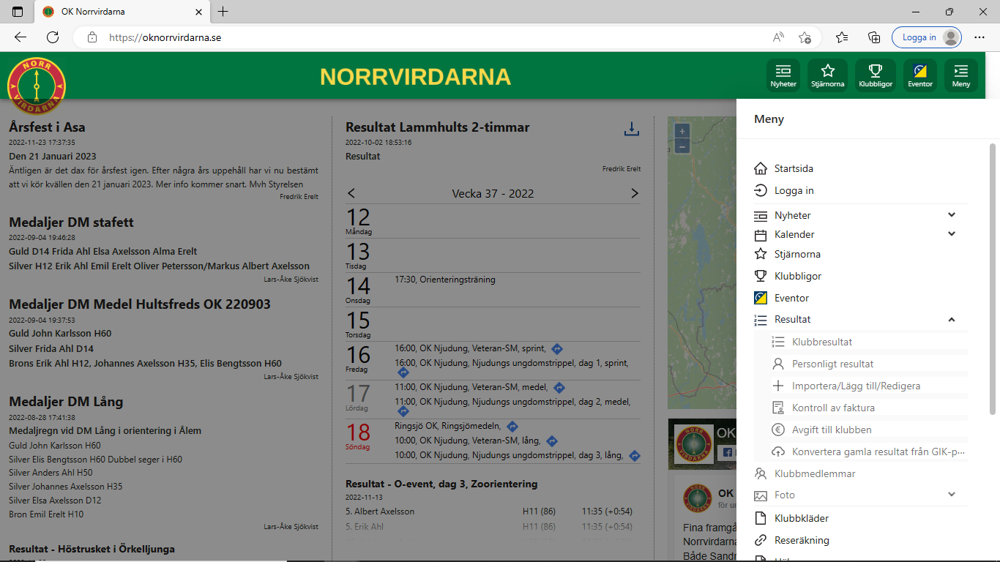
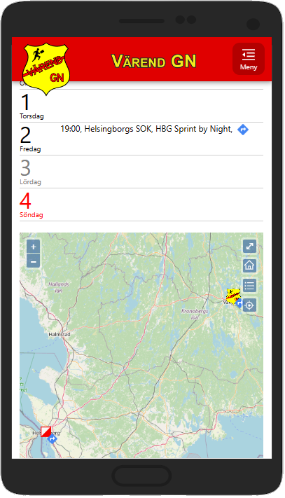
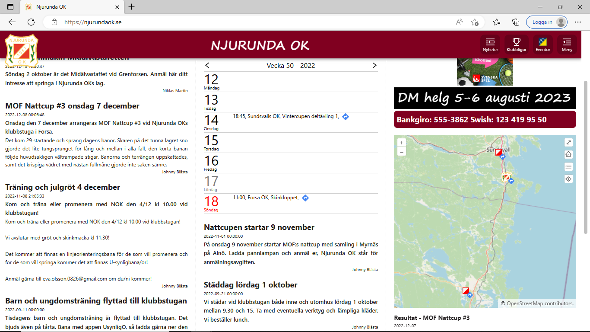

# sportclub 1.1

This is a react app for sports like orienteering, volleyball or any other sport.

## Contribute

It's free to use this as you like, but I will be happy if:

- You pay a small amount for all the time spent. 38000+ lines of code and 800+ hours. Swish between 50 SEK and 3500 SEK to 0723-750908 (Patrik Sjökvist).
- If you contribute with some development or testing.

## Clubs using sportclub / Samples

- [OK Orion](https://okorion.com/)
- [OK Norrvirdarna](https://oknorrvirdarna.se/)
- [Värend GN](https://varendgn.se/)
- [Njurunda OK](https://njurundaok.se/)






_Please email patrik@sjokvistarna.se if your club has started to use this great webpage._

## Visual Studio Code Setup

Download font "Fira Code" and use font ligatures, for a nice look and feel.

I use the following extensions

- ESLint
- Prettier - Code formatter
- React Food Truck
- Javascript (ES6) code snippets
- Simple React Snippets
- npm Intellisence
- Version Lens
- Bracket Pair Colorizer

and the following seetings:

```json
{
  "git.autofetch": true,
  "[php]": {
    "files.encoding": "utf8"
  },
  "[javascript]": {
    "editor.formatOnSave": true,
    "files.encoding": "utf8"
  },
  "versionlens.showDependencyStatusesAtStartup": true,
  "versionlens.showTaggedVersionsAtStartup": true,
  "prettier.printWidth": 120,
  "editor.codeActionsOnSave": {
    "source.fixAll.eslint": true
  },
  "git.confirmSync": false,
  "[javascriptreact]": {
    "editor.formatOnSave": true,
    "files.encoding": "utf8",
    "editor.defaultFormatter": "esbenp.prettier-vscode"
  },
  "eslint.format.enable": true,
  "extensions.ignoreRecommendations": true,
  "editor.fontFamily": "Fira Code",
  "editor.fontLigatures": true,
  "editor.formatOnSave": true
}
```

## Howto get it up and running

1. You need a webhost that's supporting
   - PHP
   - MySql with InnoDB
2. Create all tables (within "mysql" folder)
3. Copy all php scripts (within "php" folder) to your public html root folder
4. If you **not** using https://eventor.orientering.se/ as authorization provider (used by all orienteering clubs in sweden), you may need to update the following login files.
   - php/log_in.php
   - php/log_out.php
   - php/include/users.php
5. Create your own club config file in the "src/models/clubs" folder.
6. Change "src/App.tsx" to import your config instead. (import clubJson from './models/clubs/...';)
7. npm install
8. npm run build (or "npm run start" to just start it locally)
9. Copy "index.html" and "static" folder from the "build" folder to your public html root folder.
10. Done!!

## Make tiled open streetmap images from Ocad

For this task I uses three programs

- OCad orienteering
- GIMP
- QGIS

First export from OCad:

1. Transform map
   - Rotate map to zero degrees, if it's rotated
   - Change coordinate system to Google Mercator (WGS84)
2. If you exporting course do the following
   - Add a grey boxarea where you put the results (purple text)
3. Export PNG
   - Include georeference file
   - 1,0m / pixel (0,5m / pixel for courses)

GIMP (map):

1. Remove surrounding areas that doesn't belong to the map and make them 100% transparent
2. Save
3. Copy that file (and the georeference file) to a purple only png file.
4. Open the purple only png file
   1. Colors > Adjust Contrast to -127
   2. Colors > Adjust Balance magenta (rgb 255, 0, 255) to -100
   3. Colors > Color to alpha (color: white, opacity threshold: 0,015)
   4. Select by color
   5. Edit stroke 20px (line color: rgb 132, 0, 142)
5. Save

GIMP (course):

1. Colors > Color to alpha (color: white, opacity threshold: 0)
2. Colors > Adjust Contrast to +127
3. Colors > Color to alpha (color: white, blending opacity: 20,0)

QGIS:

1. Add png file(s)
   - Drag it into map
   - (Use openstreetmap layer to see that your layer ends up correctly)
   - Edit properities for map layer
     - Symbology > Set min scale to 1:20000
     - Rendering > Resampling Cubic + Oversampling 4,0
   - Edit properities for purple map layer
     - Symbology > Set max scale to 1:20000
     - Rendering > Resampling Cubic + Oversampling 4,0
   - Edit properities for course layer
     - Rendering > Resampling Linear + Oversampling 4,0
2. Raster > Generate XYZ tiles
   - Only show the layers you want to export (all maps at once, or one course layer at a time)
   - Extent > By your layer is a simple choice
   - Minimum zoom: 7 (12 for course layer)
   - Maximum zoom: 17
   - Set Output directory
3. You can remove \*.png files that are totally empty (1,21 kB)
